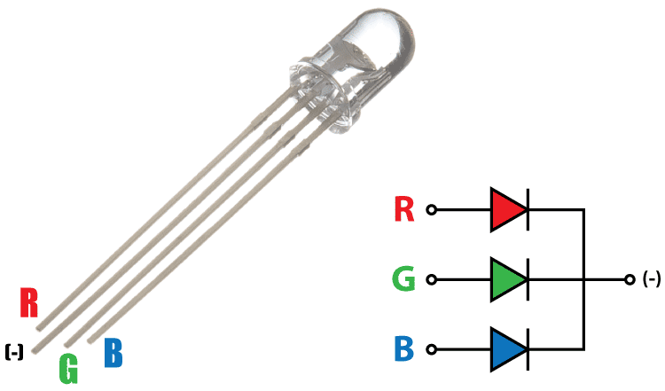
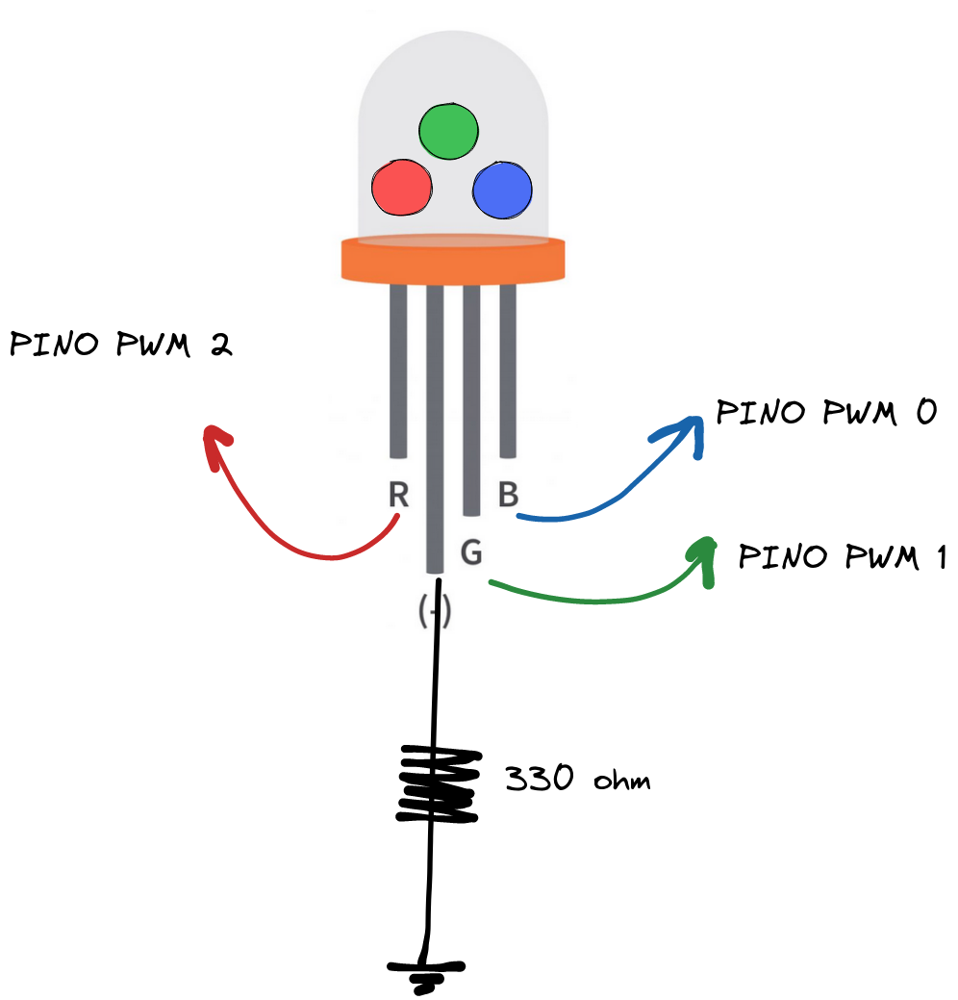
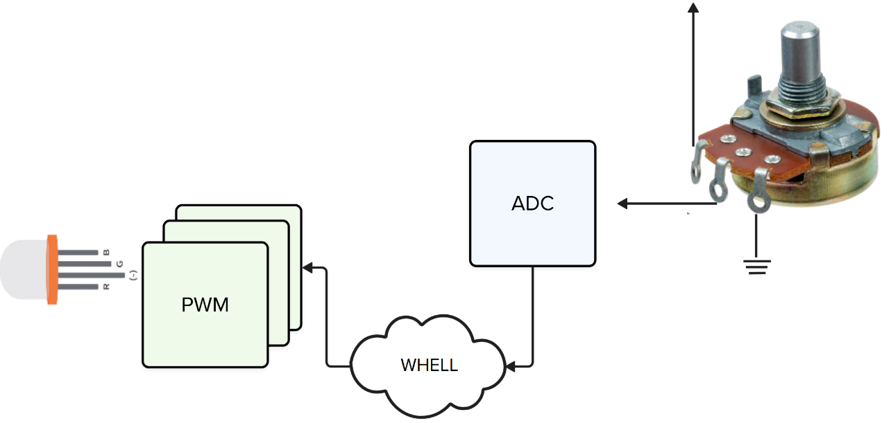
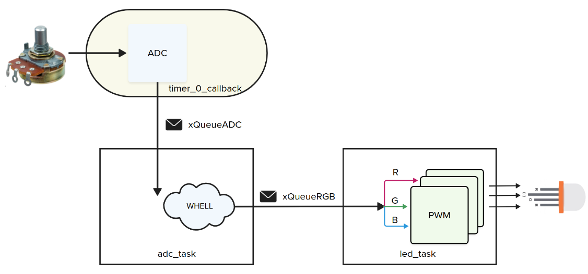

# 22b - AV2 - LED RGB

> LEIA TODOS OS PASSOS ANTES DE SAIR FAZENDO, TENHA UMA VISÃO GERAL DO TODO ANTES DE COMECAR.

Nesta avaliação vocês irão criar firmware que aciona um LED RGB de acordo com o valor de um potenciômetro. 

## Descricão

Periféricos:

- PIO
- ADC
- Timer
- PWM 

freeRTOS:

- Task
- Queue

Componentes:

- LED RGB Catodo comum
- Potenciômetro

### O que é um LED RGB?

É um componente eletrônico que possui internamente três LEDs nas cores VERMELHO (R), VERDE (G) e AZUL (B), com este componente conseguimos gerar várias cores e indicar com apenas um LED vários estados de um dispositivo (que possui uma interface homem máquina limitada).



Existem dois tipos de LED RGB: catodo comum e anodo comum, o catodo comum se refere ao led que o catodo (a parte que a corrente elétrica sai) é comum para todos, ou seja, o terra é comum:



### PWM

Para controlar o LED RGB e conseguir criar uma cor que é composta por RGB de forma granular (um pouco de vermelho, um bocado de verde e bastante azul), devemos conseguir controlar a intensidade de cada uma das cores do LED, e isso é feito com um PWM! (sim aquele de acionamentos).

O pulse width modulation (PWM) é uma modulacão que altera uma onda quadrada, definindo o tempo que o sinal fica em nível alto (duty cycle), quanto mais tempo o sinal ficar em nível alto (1), maior será a tensão média no pino, quanto mais tempo em baixo, menor será a tensão média no pino.


### ADC

Na entrega vocês devem utilizar o ADC para definir qual cor será exibida no LED (mais para frente eu vou detalhar), mas vamos definir uma função (`wheel`) que relaciona o valor do potenciômetro com as cores do LED.



## Entrega

Vocês devem desenvolver o firmware como indicado a seguir:



Onde:

- `timer_0_callback`:
  - Função de callback do timer que realiza a leitura do ADC e envia o valor lido para a fila `xQueueADC`
  
- `xQueueADC`:
  - Fila de inteiro (uint) para envio/recebimento dos dados lidos do potenciômetro.
  
- `adc_task`
    - Configura o Timer para gerar 5 IRS por segundo  
    - Possui uma fila `xQueueADC` para recebimento do valor analógico convertido
    - Chama a função `wheel` para converter um inteiro do ADC em `RGB`
    - Envia o valor `RGB` para a `led_task` via a fila `xQueueRGB`
    
- `xQueueRGB` 
    - Fila que possibilita o envio e recebimento do valor RGB
    - A fila deve ser de uma `struct` que possibilita enviar o **RGB**
    
  - `task_led`
    - Configura os três pinos para operar com PWM
    - recebe um dado na fila `xQueueRGB` e altera o duty cycle de cada PWM de acordo com o valor recebido
    
- `whell`
    - Função que converte um valor analógico (0..255) em RGB (0..255, 0..255, 0..255)
    - Use como base a seguinte função extraída de um código do arduino:
 
    ```c
    // Input a value 0 to 255 to get a color value.
    // The colours are a transition r - g - b - back to r.
    void wheel( uint WheelPos, uint8_t *r, uint8_t *g, uint8_t *b )`
      WheelPos = 255 - WheelPos;

      if ( WheelPos < 85 ) {
        *r = 255 - WheelPos * 3;
        *g =0;
        *b = WheelPos * 3;
      } else if( WheelPos < 170 ) {
        WheelPos -= 85;
        *r = 0;
        *g = WheelPos * 3;
        *b = 255 - WheelPos * 3;
      } else {
        WheelPos -= 170;
        *r = WheelPos * 3;
        *g = 255 - WheelPos * 3;
        *b = 0;
      }
    }
    ```
    
    

    ```
    ```

## Rubrica

LED varia de acordo com potenciômetro respeitando a função `wheel` (gradual do vermelho, passando pelo roxo, azul, verde, amarelo, vermelho), com:

- [ ] `task_adc` e `task_led` implementadas
- [ ] O LED é controlado por 3 PWM um para cada cor
- [ ] Timer callback para fazer leitura do ADC (5Hz)
- [ ] Fila `xQueueADC` para envio do dado do adc
- [ ] `wheel` implementado e sendo usado na `task_adc`
- [ ] `xQueueADC` e `xQueueRGB` usados para enviar dados (ADC e RGB)
